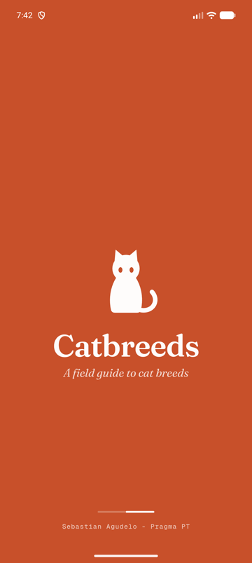
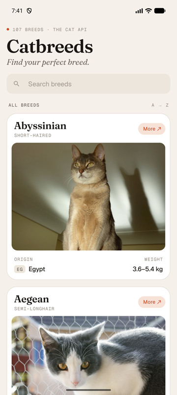
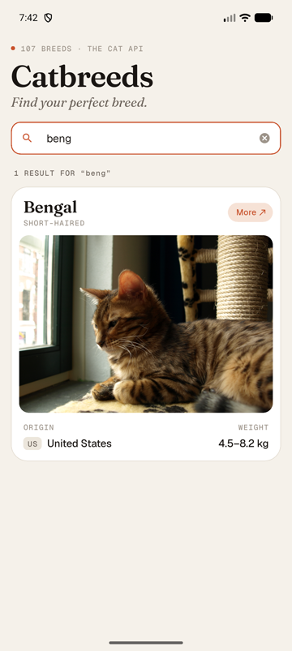
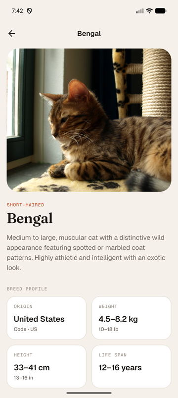
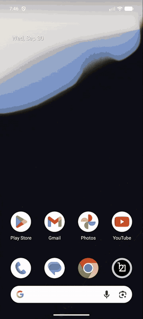

# Prueba Técnica de Flutter - Catbreeds

## Descripción

Este repositorio contiene mi solución a la prueba técnica de desarrollo móvil de **Pragma**. Es una aplicación Flutter para iOS y Android que muestra un catálogo de razas de gato consumiendo [The Cat API](https://developers.thecatapi.com/), con splash, listado con búsqueda y vista de detalle.

Diseño en Figma: [Catbreeds — Prueba técnica Pragma](https://www.figma.com/design/qwf9mfXFvY4A6ngNtPgNe3/Catbreeds---Prueba-t%C3%A9cnica-Pragma?node-id=2-8&t=zPttcsc2JBRvzaJN-1).

## Capturas

| Splash | Lista | Búsqueda | Detalle |
|:---:|:---:|:---:|:---:|
|  |  |  |  |

<p align="center"></p>

## Instalación

Si solo se quiere probar en Android, el APK está en la sección **Releases** de este repositorio y no necesita configurar nada.

Para compilarla tú mismo necesitas Flutter 3.38 (Dart 3.10) o superior. Luego sigue estos pasos:

1. Clona este repositorio en tu máquina local.
2. En la terminal, navega hasta la carpeta del proyecto.
3. Copia la plantilla de variables de entorno y pega la API key de The Cat API que viene en el enunciado:
   ```bash
   cp .env.example .env
   ```
4. Instala las dependencias y genera el código (Envied):
   ```bash
   flutter pub get
   dart run build_runner build --delete-conflicting-outputs
   ```
5. Ejecuta `flutter run` para iniciar la aplicación.

(El paso 3 es obligatorio: sin la key la API responde `403`. La key se compila ofuscada con Envied y el `.env` no se versiona. Si editas el `.env`, corre antes `dart run build_runner clean`, porque `build_runner` no detecta esos cambios).

Para correr los lints y las pruebas:

```bash
flutter analyze
flutter test
```

## Características

La aplicación incluye las siguientes características:

**Splash:**

- Continúa el splash nativo (`flutter_native_splash`) con el título de la app y una imagen de gato.
- Mientras se muestra, precarga la primera página de razas para que el listado abra con datos.

**Listado de razas (landing):**

- Cards con el nombre de la raza, el botón "More" para ir al detalle, la foto, el país de origen y el peso.
- Scroll infinito con paginación (`limit=20`, el total se lee del header `pagination-count`). Si falla una página, lo ya cargado se conserva y solo el pie ofrece reintentar.
- Pull to refresh y skeletons de carga.

**Búsqueda:**

- Búsqueda por nombre de la raza en inglés contra la API (`/v1/breeds/search`), con debounce de 350 ms.
- Las respuestas que llegan fuera de orden se descartan (si "ben" responde después que "beng", se ignora).

**Detalle de la raza:**

- La imagen queda fija en la parte superior y solo la información hace scroll. Al subir, el texto se desvanece al pasar por debajo de la foto.
- Muestra la descripción, el país de origen, el peso, la altura, la esperanza de vida y el temperamento.

**Componentes nativos por plataforma:**

- En iOS usa `CupertinoSearchTextField` con el botón "Cancel"; en Android, el `TextField` de Material.
- `RefreshIndicator.adaptive`, `CircularProgressIndicator.adaptive`, `BackButton`, transiciones y física de scroll propias de cada plataforma.

## Un hallazgo sobre la API

Hoy The Cat API **ya no devuelve `intelligence` ni `adaptability`**, aunque el enunciado pide mostrarlos. Lo verifiqué con la key del enunciado en `/v1/breeds`, `/v1/breeds/{id}`, `/v1/breeds/search` y `/v1/images`: ninguna raza trae esas escalas.

Ejemplo de respuesta:
    {
        "id": "acur",
        "name": "American Curl",
        "species_id": "1",
        "life_span": "12-16",
        "temperament": "Affectionate, Curious, Intelligent, Interactive, Lively, Playful, Social",
        "origin": "United States",
        "country_codes": "US",
        "country_code": "US",
        "description": "Medium-sized cat with distinctive backward-curling ears, elegant body, and silky coat. Known for its kitten-like personality that persists into adulthood.",
        "bred_for": null,
        "perfect_for": null,
        "breed_group": "Short/Long-hair",
        "history": "Originated in 1981 in Lakewood, California, when a stray black kitten with unusual curled ears was found. The curl is caused by a dominant gene. Recognized by major cat registries and known for maintaining a kitten-like personality throughout life.",
        "reference_image_id": "ZZmFRKWZZ",
        "weight": {
            "imperial": "7-11",
            "metric": "3.2-5"
        },
        "height": {
            "imperial": "9-12",
            "metric": "23-30"
        },
        "image": {
            "id": "ZZmFRKWZZ",
            "url": "https://cdn2.thecatapi.com/images/ZZmFRKWZZ.jpg",
            "width": 1980,
            "height": 1355
        }
    }

Para no mostrar "No data" en todas las cards, la app usa datos que sí vienen en todas las razas y mantiene la estructura visual del wireframe:

| Donde el enunciado pide | La app muestra |
|---|---|
| Inteligencia (card) | Peso en kg |
| Inteligencia (detalle) | Peso en kg, con libras debajo |
| Adaptabilidad (detalle) | Altura en cm, con pulgadas debajo |

## Notas Adicionales

He usado una arquitectura limpia (Clean Architecture) en cuatro capas, escalable y con la misma estructura que uso en proyectos en producción:

```
lib/
├── core/          configuración (Envied), constantes, DI, errores, red, rutas y tema
├── domain/        entidades, contratos de repositorio y casos de uso
├── data/          datasources, modelos (DTO) e implementación de repositorios
└── presentation/  sistema de diseño (widgets globales) y módulos splash y breeds
```

- **Flujo de datos:** DataSource → Repository → UseCase → Provider (Riverpod) → UI.
- **Manejo de errores:** nada lanza excepciones por encima de la capa `data`. `DioClient` traduce cada error a un `Failure` tipado (red, servidor, parseo…) y todo viaja como `Either<Failure, T>` con fpdart. Cada estado de error tiene su botón de reintentar.
- **Imágenes:** las originales pesan hasta 6 MB, así que se decodifican al ancho real en pantalla, con caché en disco y una imagen de respaldo para las razas sin foto.
- **Estado persistente:** al volver del detalle, el listado conserva las páginas cargadas y la posición del scroll.
- **Sistema de diseño:** colores, tipografía (Fraunces, Geist y Geist Mono) y espaciado en tokens que reflejan las variables de Figma.
- **Pruebas:** unitarias y de widgets para el modelo, la capa de red, el repositorio, los notifiers y las pantallas, con mocktail.

**Stack:** Flutter 3.38 · Riverpod 2 · go_router · Dio · fpdart · Envied · cached_network_image · flutter_svg · mocktail.

Más detalle de la arquitectura en [docs/ARCHITECTURE.md](docs/ARCHITECTURE.md).

Espero que encuentres mi solución satisfactoria. Estoy abierto a cualquier feedback.

## Contacto

Si tienes alguna pregunta o comentario sobre mi solución, no dudes en contactarme a través de sagudeloalvarez@gmail.com.
